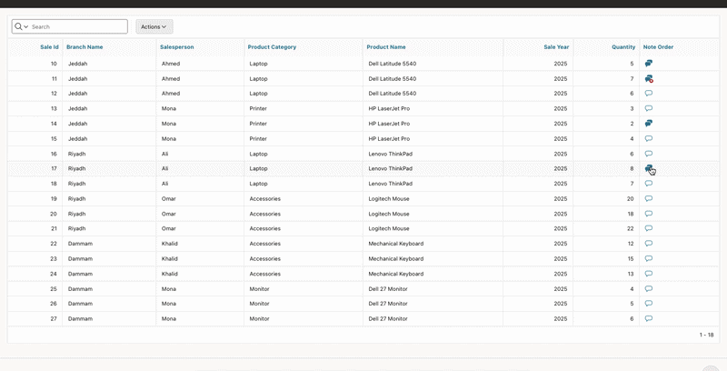

# Reusable Transaction Chat for Oracle APEX

A reusable chat system built from scratch using **Oracle APEX**, **PL/SQL**, **JavaScript**, and the **Classic Report (Comments Template)**.

The component enables users to communicate and collaborate directly within business transactions. Instead of creating a separate chat page for every module, a single dialog page can be integrated into any report or form by passing the transaction type and record identifier.

Designed for enterprise applications, this solution keeps discussions connected to the records they belong to, improving collaboration without leaving the current page.

---

## Features

* 💬 Modern chat interface.
* 👉 Current user's messages are displayed on the right.
* 👈 Other users' messages are displayed on the left.
* 🔔 Automatic unread message notifications.
* 💭 Empty chat icon when no messages exist.
* 💬 Standard chat icon when all messages have been read.
* ⭐ Highlighted chat icon when new unread messages are available.
* 🌍 Public messages visible to all authorized users.
* 🔒 Private notes visible only to their creator.
* 📎 Support for file attachments.
* 📂 Support for all file types.
* 👤 Per-user read tracking.
* ♻️ Reusable dialog page.
* ⚡ Lightweight implementation using native Oracle APEX components without third-party plugins.

---

## How It Works

Each report can include a chat column by calling the `GET_CHAT_ICON` function.

Example:

```sql
GET_CHAT_ICON(
    '019',
    SALE_ID
) AS CHAT_ICON
```

Where:

* **019** represents the transaction type.
* **SALE_ID** is the record identifier.

Clicking the chat icon opens the reusable chat dialog and automatically loads the conversation related to the selected record.

---

## Chat Status

The chat icon changes automatically depending on the conversation status.

| Icon | Description                       |
| ---- | --------------------------------- |
| 💭   | No messages exist                 |
| 💬   | Messages exist and have been read |
| ⭐💬  | New unread messages are available |

The unread status is determined by comparing:

* The latest chat message date.
* The last visit date of the current user.

This allows every user to immediately identify records containing new conversations.

---

## Public & Private Messages

Each message can be created as one of the following:

### Public

Visible to all users who have access to the transaction.

### Private

Visible only to the user who created the message.

Private messages allow users to keep personal notes without exposing them to other users.

---

## File Attachments

Users can attach files to chat messages without restricting the file type.

All attachments are stored as BLOBs in the Oracle Database.

---

## Secure File Delivery

Attachments are retrieved through an Oracle APEX Application Process, which streams files directly from the database using the correct MIME type and HTTP response headers.

This approach provides:

* Secure file delivery.
* Direct access to attached files.
* Browser-friendly file handling.
* BLOB-based storage without exposing physical file locations.

---

## Easy Integration

The chat component can be integrated into any Oracle APEX report or page with minimal configuration.

Simply add the `GET_CHAT_ICON` function to your SQL query and provide the transaction type and record identifier.

When users click the chat icon, the component automatically opens the corresponding conversation for that record.

This approach keeps the implementation simple while allowing the same chat system to be used consistently across different parts of the application.

---

## Technologies Used

* Oracle APEX
* Oracle Database
* PL/SQL
* SQL
* JavaScript
* Classic Report (Comments Template)
* Oracle APEX Application Process
* BLOB File Storage

---

## Demo

The GIF below demonstrates the component in action.



---

## Why This Project?

Business applications often require users to communicate about specific records such as sales orders, customers, projects, or support tickets.

This project provides a reusable transaction-based chat system that can be integrated into any Oracle APEX application with minimal configuration.

It combines transaction-linked conversations, unread message indicators, public and private messaging, file attachments, secure BLOB file delivery, and a familiar chat interface into a single reusable solution built entirely with native Oracle APEX technologies.
